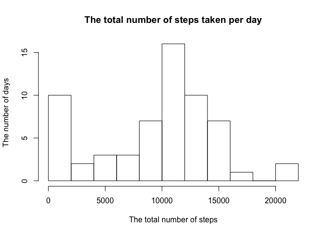
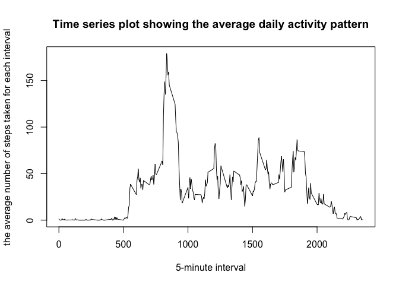
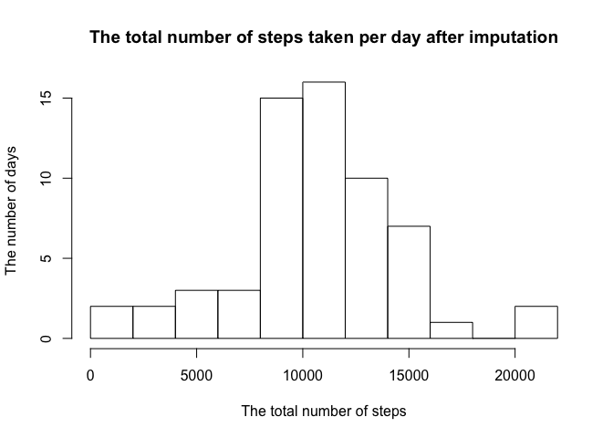
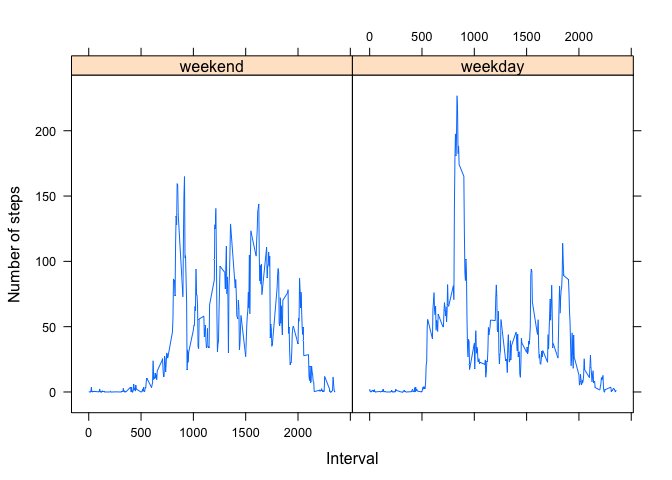

## Loading and preprocessing the data
First, we need to load this personal movement data. Here's how to do it.


```r
act <- read.csv("activity.csv")
```

Let's see how big this data is and what are the variables.

```r
dim(act)
```

```
## [1] 17568     3
```

```r
head(act)
```

```
##   steps       date interval
## 1    NA 2012-10-01        0
## 2    NA 2012-10-01        5
## 3    NA 2012-10-01       10
## 4    NA 2012-10-01       15
## 5    NA 2012-10-01       20
## 6    NA 2012-10-01       25
```

```r
tail(act)
```

```
##       steps       date interval
## 17563    NA 2012-11-30     2330
## 17564    NA 2012-11-30     2335
## 17565    NA 2012-11-30     2340
## 17566    NA 2012-11-30     2345
## 17567    NA 2012-11-30     2350
## 17568    NA 2012-11-30     2355
```
As we can see, we have a compact dataset with only the number of steps per time interval as our measurement. The data was collected for 2 months (from 2012-10-01 until 2012-11-30).

A further exploration shows that our date column is already a factor.

```r
str(act)
```

```
## 'data.frame':	17568 obs. of  3 variables:
##  $ steps   : int  NA NA NA NA NA NA NA NA NA NA ...
##  $ date    : Factor w/ 61 levels "2012-10-01","2012-10-02",..: 1 1 1 1 1 1 1 1 1 1 ...
##  $ interval: int  0 5 10 15 20 25 30 35 40 45 ...
```
## What is mean total number of steps taken per day?
To answer this question, I am going to use the rowsum function to produce a rough histogram of the total number of steps taken per day.

```r
hist(rowsum(act$steps,act$date,na.rm=TRUE),10,main="The total number of steps taken per day",xlab="The total number of steps",ylab="The number of days")
```

<!-- -->

And here are the mean and median of the total number of steps taken per day.

```r
mean(rowsum(act$steps,act$date,na.rm=TRUE))
```

```
## [1] 9354.23
```

```r
median(rowsum(act$steps,act$date,na.rm=TRUE))
```

```
## [1] 10395
```

## What is the average daily activity pattern?
Now, let's explore the pattern of steps across time intervals.

```r
a <- rowsum(act$steps,as.factor(act$interval),na.rm=TRUE)/61
plot(dimnames(a)[[1]],a,type="l",xlab="5-minute interval",ylab="the average number of steps taken for each interval",main="Time series plot showing the average daily activity pattern")
```

<!-- -->

Which 5-minute interval, on average across all the days in the dataset, contains the maximum number of steps?

```r
m <- max(a)
which(a==m)
```

```
## [1] 104
```
Let's check if our answer is correct.

```r
a[104,]
```

```
##      835 
## 179.1311
```
So, it appears that record 104, which shows the interval 835, has the highest step activity during the day. The interval 835 translates to 13 hours 55 minutes.

## Imputing missing values
We noticed from the beginning that our data contains some NA values. Let's pay attention to NAs now. How many records have NA values?


```r
sum(is.na(act$steps))
```

```
## [1] 2304
```

That's about 13.1147541 % of the whole dataset. Where does NA occurs?


```r
unique(act[is.na(act$steps),]$date)
```

```
## [1] 2012-10-01 2012-10-08 2012-11-01 2012-11-04 2012-11-09 2012-11-10
## [7] 2012-11-14 2012-11-30
## 61 Levels: 2012-10-01 2012-10-02 2012-10-03 2012-10-04 ... 2012-11-30
```

```r
unique(act[is.na(act$steps),]$interval)
```

```
##   [1]    0    5   10   15   20   25   30   35   40   45   50   55  100  105
##  [15]  110  115  120  125  130  135  140  145  150  155  200  205  210  215
##  [29]  220  225  230  235  240  245  250  255  300  305  310  315  320  325
##  [43]  330  335  340  345  350  355  400  405  410  415  420  425  430  435
##  [57]  440  445  450  455  500  505  510  515  520  525  530  535  540  545
##  [71]  550  555  600  605  610  615  620  625  630  635  640  645  650  655
##  [85]  700  705  710  715  720  725  730  735  740  745  750  755  800  805
##  [99]  810  815  820  825  830  835  840  845  850  855  900  905  910  915
## [113]  920  925  930  935  940  945  950  955 1000 1005 1010 1015 1020 1025
## [127] 1030 1035 1040 1045 1050 1055 1100 1105 1110 1115 1120 1125 1130 1135
## [141] 1140 1145 1150 1155 1200 1205 1210 1215 1220 1225 1230 1235 1240 1245
## [155] 1250 1255 1300 1305 1310 1315 1320 1325 1330 1335 1340 1345 1350 1355
## [169] 1400 1405 1410 1415 1420 1425 1430 1435 1440 1445 1450 1455 1500 1505
## [183] 1510 1515 1520 1525 1530 1535 1540 1545 1550 1555 1600 1605 1610 1615
## [197] 1620 1625 1630 1635 1640 1645 1650 1655 1700 1705 1710 1715 1720 1725
## [211] 1730 1735 1740 1745 1750 1755 1800 1805 1810 1815 1820 1825 1830 1835
## [225] 1840 1845 1850 1855 1900 1905 1910 1915 1920 1925 1930 1935 1940 1945
## [239] 1950 1955 2000 2005 2010 2015 2020 2025 2030 2035 2040 2045 2050 2055
## [253] 2100 2105 2110 2115 2120 2125 2130 2135 2140 2145 2150 2155 2200 2205
## [267] 2210 2215 2220 2225 2230 2235 2240 2245 2250 2255 2300 2305 2310 2315
## [281] 2320 2325 2330 2335 2340 2345 2350 2355
```

The results show that the data is only missing for 8 out of 61 days, leaving 53 days with complete data for all time intervals. The data is also possibly missing for any interval during the day (188 out of 188 intervals).

Let's impute the missing values with mean for the intervals. I will create another variable to contain this new dataset.


```r
act_noNA <- act
act_noNA[is.na(act_noNA$steps),1] <- a[match(act_noNA[is.na(act_noNA$steps),3],rownames(a))]
head(act_noNA)
```

```
##        steps       date interval
## 1 1.49180328 2012-10-01        0
## 2 0.29508197 2012-10-01        5
## 3 0.11475410 2012-10-01       10
## 4 0.13114754 2012-10-01       15
## 5 0.06557377 2012-10-01       20
## 6 1.81967213 2012-10-01       25
```

```r
tail(act_noNA)
```

```
##           steps       date interval
## 17563 2.2622951 2012-11-30     2330
## 17564 4.0819672 2012-11-30     2335
## 17565 2.8688525 2012-11-30     2340
## 17566 0.5573770 2012-11-30     2345
## 17567 0.1967213 2012-11-30     2350
## 17568 0.9344262 2012-11-30     2355
```

```r
sum(is.na(act_noNA$steps))
```

```
## [1] 0
```

Now, let's take a look at the histogram and mean and median of the total number of steps each day and see if they differ from the first part of assignment.


```r
hist(rowsum(act_noNA$steps,act_noNA$date,na.rm=TRUE),10,main="The total number of steps taken per day after imputation",xlab="The total number of steps",ylab="The number of days")
```

<!-- -->

And here are the mean and median of the total number of steps taken per day.

```r
mean(rowsum(act_noNA$steps,act_noNA$date,na.rm=TRUE))
```

```
## [1] 10581.01
```

```r
median(rowsum(act_noNA$steps,act_noNA$date,na.rm=TRUE))
```

```
## [1] 10395
```
## Are there differences in activity patterns between weekdays and weekends?
First, I am adding a new variable called weekday to our data frame.


```r
act_noNA$date <- as.Date(act_noNA$date)
weekend <- c("Saturday","Sunday")
act_noNA$weekend <- factor((weekdays(act_noNA$date) %in% weekend),levels=c(TRUE,FALSE),labels=c("weekend","weekday"))
```

To further investigate this point, I am going to make a panel plot comparing the average number of steps taken, across weekdays and weekends.


```r
plotdata <- aggregate(steps~interval+weekend, data=act_noNA, mean)
library(lattice)
xyplot(steps~interval|factor(weekend), data=plotdata, type="l", xlab="Interval", ylab="Number of steps")
```

<!-- -->
